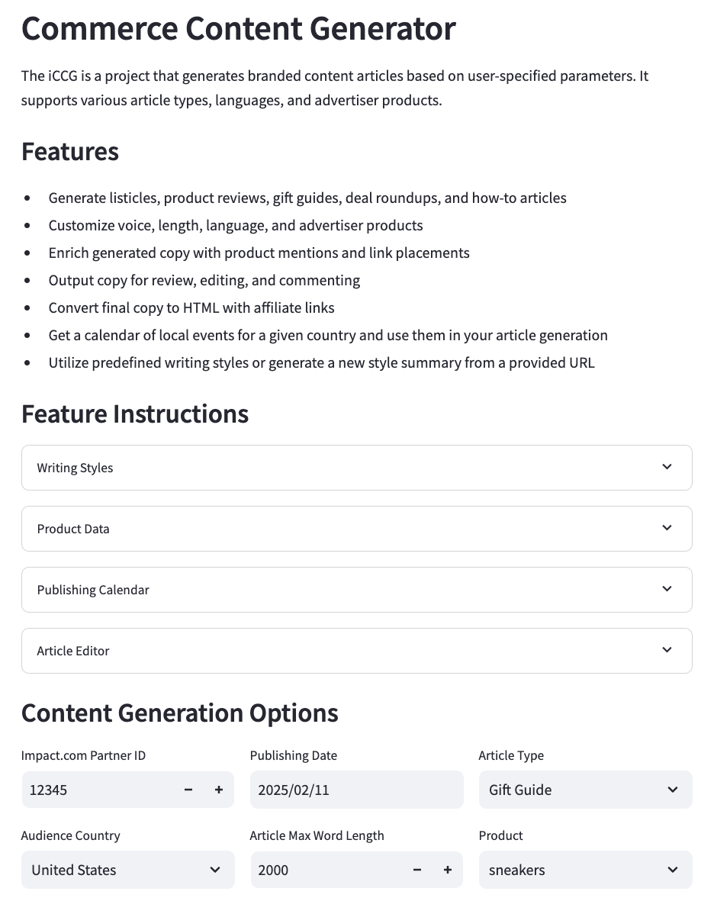
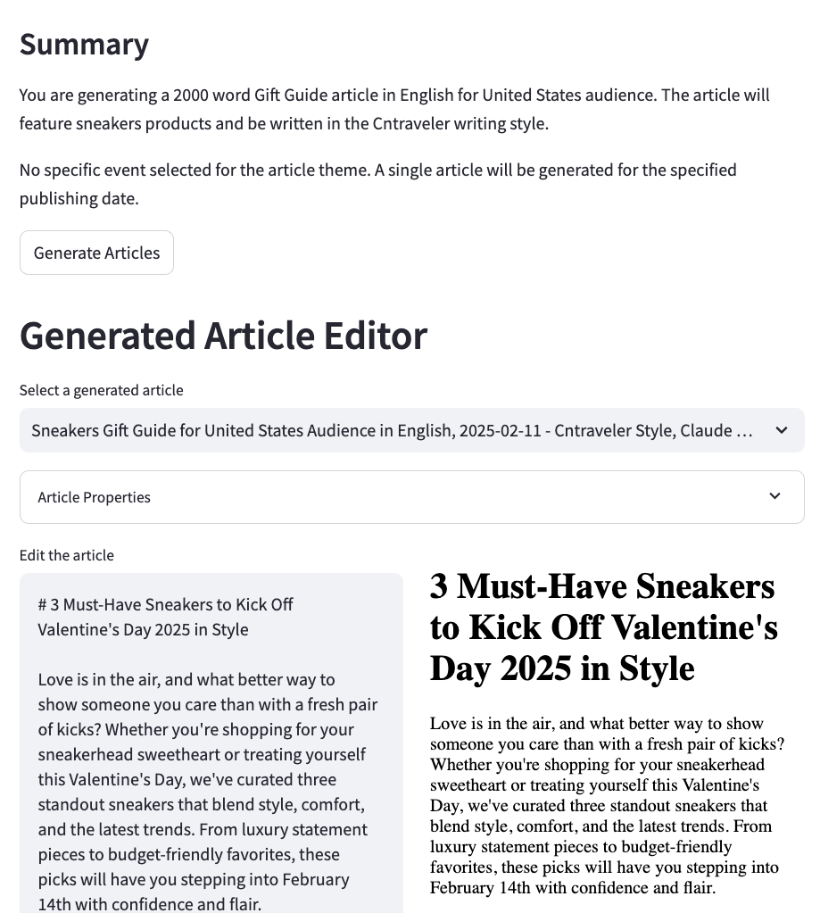

# Commerce Content Generator

This project generates branded content articles based on user-specified parameters. It supports various article types, languages, and advertiser products using Anthropic's Claude AI models.

[Live Demo Here](https://commercecontentgenerator-azd6mpn6hmkqn4fuquexkm.streamlit.app/)

### Features
- Generate listicles, product reviews, gift guides, deal roundups, and how-to articles
- Customize voice, length, language, and advertiser products
- Enrich generated copy with product mentions and link placements
- Output copy for review, editing, and commenting
- Convert final copy to HTML with affiliate links
- Utilize predefined writing styles or generate a new style summary from a provided URL
- Get a calendar of local events for a given country and use them in your article generation



## Requirements

- Python 3.12+
- UV package manager
- Anthropic API key

## Installation

1. Clone the repository
2. Install dependencies using UV:
   ```bash
    uv sync && uv venv
   ```

## Usage

1. Run the Streamlit app:
   ```bash
   uv run streamlit run comm_con_gen/streamlit_app.py
   ```

2. Enter your Anthropic API key in the sidebar configuration panel

3. Select content generation options:
   - Partner ID
   - Publishing Date
   - Article Type (Gift Guide, Product Review, etc.)
   - Audience Country
   - Article Max Word Length
   - Product Category
   - Language
   - LLM Model (see below)
   - Writing Style

### Available LLM Models

The application supports the following Anthropic Claude models:

| Model Name | Model ID |
|------------|----------|
| Claude 3.5 Sonnet | claude-3-5-sonnet-20241022 |
| Claude 3.5 Haiku | claude-3-5-haiku-20241022 |
| Claude 3 Opus | claude-3-opus-20240229 |
| Claude 3 Sonnet | claude-3-sonnet-20240229 |
| Claude 3 Haiku | claude-3-haiku-20240307 |

## Project Structure

```
comm_con_gen/
├── __init__.py
├── streamlit_app.py    # Main Streamlit application
├── utility.py          # Core functionality and API interactions
├── countries.py        # Country-specific language mappings
├── guides/            # Article format templates
│   ├── giftguide.txt
│   ├── howto.txt
│   ├── listicle.txt
│   ├── product_review.txt
│   └── dealradar.txt
├── prompts/           # LLM prompt templates
│   ├── country_events.txt
│   └── get_voice_prompt.txt
├── test_products/     # Sample product data
│   └── *.json
├── outputs/          # Generated markdown articles
├── html_outputs/     # Generated HTML articles
└── voices/          # Cached writing style analyses
```

### Key Components

- `streamlit_app.py`: Main application interface with API key management and content generation options
- `utility.py`: Core functionality including:
  - LLM model management and API interactions
  - Article generation and formatting
  - HTML conversion and affiliate link processing
  - Publishing calendar generation
  - Writing style analysis
- `countries.py`: Manages country-specific language mappings and localization
- `guides/`: Contains templates for different article types
- `test_products/`: Sample product data in JSON format with details like name, description, price, etc.

## Development

The project uses:
- UV for dependency management
- pyproject.toml for project configuration
- Type hints throughout the codebase
- Google-style docstrings
- Async/await for API operations

## TODO
- Add support for image formatting and placement
- Expand article type templates
- Add more language support
- Implement caching for API responses
- Add unit tests and integration tests
